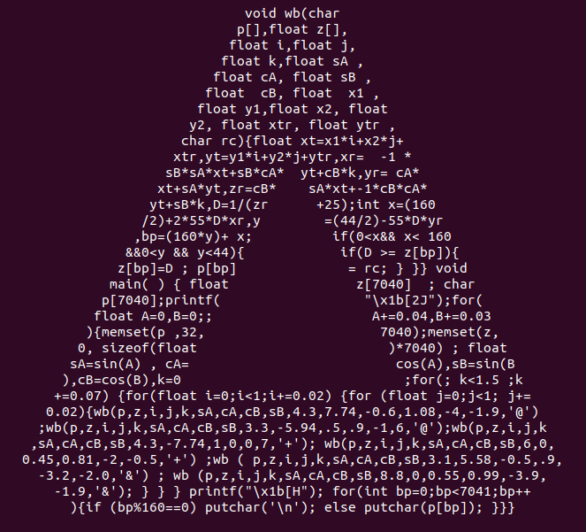

# penrose.c



```
gcc penrose.c -lm
./a.out
```
The speed at which the triangle rotates is controlled by how dense the points we calculate are! If you want it to rotate faster, find and replace "0.02" with e.g. "0.07". You might have to play around a bit, or even decrease "0.02" to e.g. "0.005" if it's rotating too fast. In addition, if you want it to work on a buffer with *x* columns and *y* rows, replace "160" => *x*, "44" => *y*, "7040" => "*x\*y*"

This is a shameless rip-off of donut.c by a1k0n: https://www.a1k0n.net/2006/09/15/obfuscated-c-donut.html. It does not add any additional cleverness, and likely suffers from massive structural inefficiencies, not to mention the litany of minor improvements I probably could have implemented if I'd read more than the first two chapters of K&R2 before school started and I got busy.

Oh well! This was a lot of fun to code.
